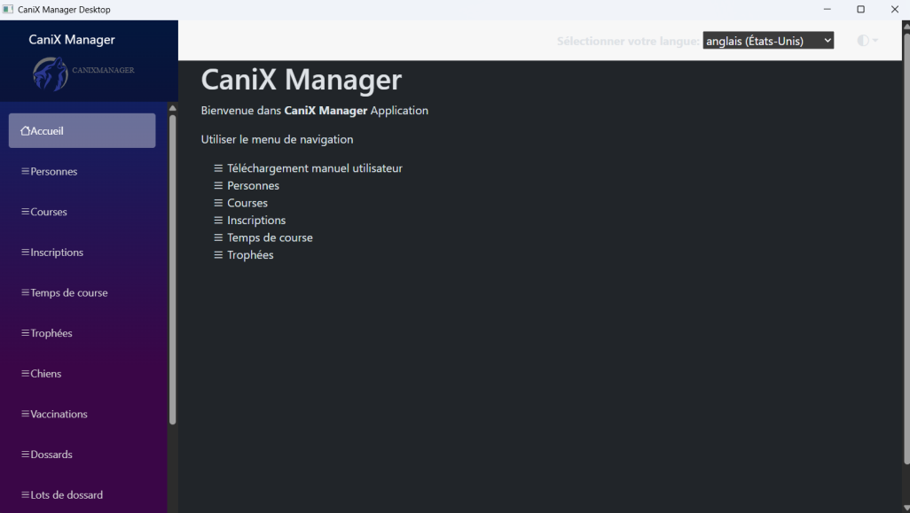
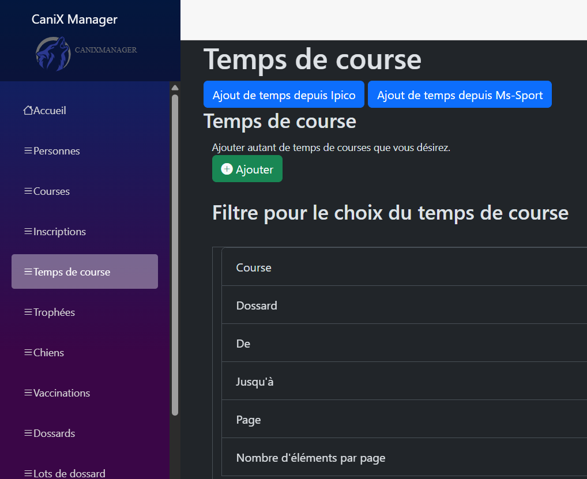
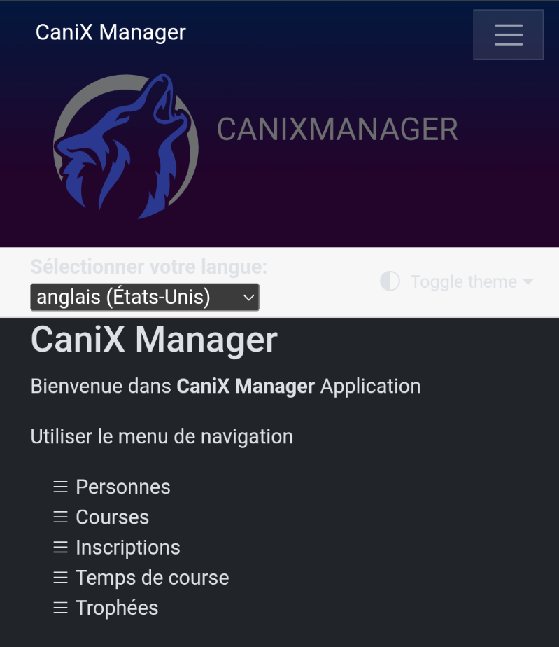
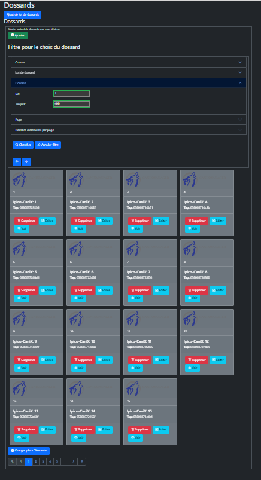

# Salut, je suis Florian 👋

*[English version below ⬇️](#hi-im-florian-)*

Développeur full-stack, je construis actuellement plusieurs applications web en solo — des SaaS accessibles jusqu'à un outil métier pour la gestion de courses canines.

## 🚧 Projets en cours

### 🌐 Terres Communes — écosystème citoyen
Plateforme délibérative composée de plusieurs sous-projets indépendants, avec authentification centralisée via SSO.

- **forum-terres-communes**  — Forum délibératif pour les communs : discussions structurées, cercles thématiques, réactions nuancées. PWA installable. En production sur [forum.terrescommunes.com](https://forum.terrescommunes.com).
- **site-terres-communes**  — Site vitrine de l'écosystème : pages éditoriales, PWA installable, panneau d'accessibilité (thème + police OpenDyslexic), back-office avec génération de synthèses éditoriales assistée par l'API Claude, notifications push. En production sur [terrescommunes.com](https://terrescommunes.com).

### ♿ Inclusa
SaaS de diagnostic et de suivi d'accessibilité web (WCAG), destiné en priorité aux PME et associations francophones. PWA installable. Scan automatisé de sites, chiffrement des données sensibles au repos, gestion multi-comptes avec 2FA et invitations.

### 🐕 WebCaniXManager  
Application de gestion de courses de canicross/CaniX, hébergée on-premise : chronométrage par puces RFID, calcul de classements et trophées, export Excel, gestion multi-sites.

- Interface web multilingue (français, anglais, allemand, avec variantes régionales) et thème clair/obscur, utilisable sur ordinateur, tablette ou smartphone sans aucune installation.
- Version Desktop Windows complémentaire, installable en un clic depuis le réseau local, sans connexion internet requise même pour l'installation initiale.
- Import des temps de course depuis les lecteurs de puces RFID Ipico, ou depuis un fichier Excel exporté de Ms-Sport/Wiclax.
- Génération et téléchargement des fichiers d'inscriptions, de classements et de trophées au format Excel.
- Gestion complète des personnes, chiens, licences, dossards, catégories, fédérations et grilles de points, avec recherche et pagination.
- Fonctionne entièrement en réseau local, sans connexion internet requise le jour de la course.

**Fonctionnalités**

- **Participants** : personnes, leurs licences et leurs chiens, et les vaccinations des chiens.
- **Courses et trophées** : courses rattachées à des trophées, catégories par discipline, grilles de points, fédérations.
- **Inscriptions** : contrôlées selon la catégorie (âge de la personne et des chiens, nombre de chiens, genre) et selon la limite journalière de participations avec engin roulant par chien.
- **Chronométrage** : temps de course importés depuis les fichiers Ipico et Ms-Sport/Wiclax, et dossards importés depuis un fichier.
- **Classements et exports** : fichiers Excel des inscriptions, des classements de course et de trophée, et des licences de la saison.
- **Langues** : français, anglais et allemand, y compris le manuel utilisateur téléchargeable, qui suit la langue d'affichage active.

  
  
  
  

> Ces projets sont hébergés dans des dépôts privés — seuls les sites en production listés ci-dessus sont accessibles publiquement.

## 🛠️ Technologies employées

`PHP` · `C#` · `.NET` · `Blazor` · `JavaScript` · `SQL` · `MariaDB` · `Playwright` · `PHPUnit` · `Docker` · `GitHub Actions`

## 📫 Me contacter

N'hésitez pas à me contacter si vous avez une question ou une suggestion à propos de ces projets.

---

# Hi, I'm Florian 👋

*[Version française plus haut ⬆️](#salut-je-suis-florian-)*

Full-stack developer, currently building several web applications solo — from accessibility-focused SaaS products to a business tool for dog-sport race management.

## 🚧 Current projects

### 🌐 Terres Communes — citizen ecosystem
Deliberative platform made up of several independent sub-projects, with centralized authentication via SSO.

- **forum-terres-communes**  — Deliberative forum for the commons: structured discussions, topic-based circles, nuanced reactions. Installable PWA. Live at [forum.terrescommunes.com](https://forum.terrescommunes.com).
- **site-terres-communes**  — The ecosystem's showcase site: editorial pages, installable PWA, accessibility panel (theme + OpenDyslexic font), back-office with AI-assisted editorial summary generation, push notifications. Live at [terrescommunes.com](https://terrescommunes.com).

### ♿ Inclusa
SaaS for web accessibility (WCAG) auditing and monitoring, primarily aimed at French-speaking SMEs and nonprofits. Installable PWA. Automated site scanning, encryption of sensitive data at rest, multi-account management with 2FA and invitations.

### 🐕 WebCaniXManager  
Race management application for canicross/CaniX events, hosted on-premise: RFID chip timing, standings and trophy calculation, Excel export, multi-venue management.

- Multilingual web interface (French, English, German, with regional variants) and light/dark theme, usable on desktop, tablet or smartphone with no installation required.
- Companion Windows Desktop version, installable in one click from the local network, with no internet connection required even for the initial install.
- Time imports from Ipico RFID chip readers, or from an Excel file exported from Ms-Sport/Wiclax.
- Generation and download of registration, standings and trophy files in Excel format.
- Full management of people, dogs, licenses, bibs, categories, federations and points grids, with search and pagination.
- Runs entirely on the local network, with no internet connection required on race day.

**Features**

- **Participants**: people, their licenses and dogs, and the dogs' vaccinations.
- **Races and trophies**: races attached to trophies, categories by discipline, points grids, federations.
- **Registrations**: checked against the category (age of the person and of the dogs, number of dogs, gender) and against the daily limit of participations with a rolling equipment per dog.
- **Timing**: race times imported from Ipico and Ms-Sport/Wiclax files, and bibs imported from a file.
- **Rankings and exports**: Excel files of the registrations, race and trophy rankings, and the season's licenses.
- **Languages**: French, English and German, including the downloadable user manual, which follows the active display language.

  
  
  
  

> These projects live in private repositories — only the production sites linked above are publicly accessible.

## 🛠️ Technologies used

`PHP` · `C#` · `.NET` · `Blazor` · `JavaScript` · `SQL` · `MariaDB` · `Playwright` · `PHPUnit` · `Docker` · `GitHub Actions`

## 📫 Get in touch

Feel free to reach out if you have a question or a suggestion about any of these projects.
